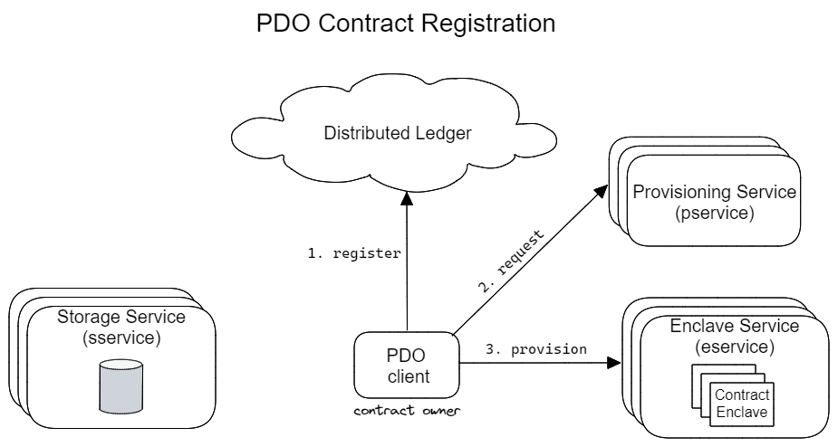
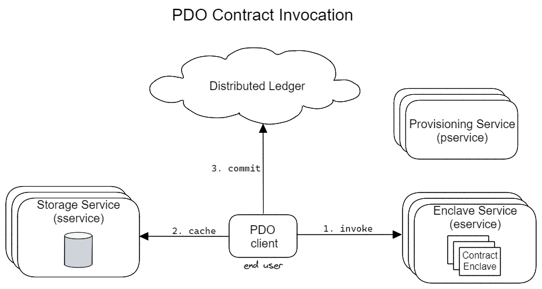
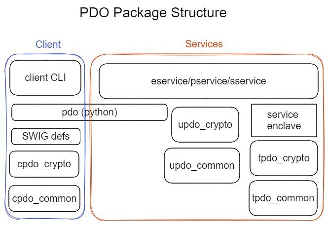

<!---
Licensed under Creative Commons Attribution 4.0 International License
https://creativecommons.org/licenses/by/4.0/
--->

# Private Data Objects - Specification overview

A **Private Data Object (PDO)** is a smart contract that defines data access
and update policies that are embedded in the object. As such, these policies 
are carried with the object regardless of where it resides, or how often it
changes ownership.

Mutually distrusting parties can then use PDOs to share data and coordinate
operations in a privacy-preserving way. To enforce the smart contracts
policies at run-time, contracts are run inside Trusted Execution
Environment (TEE).

## Components

PDOs relies on the following components that make up the infrastruture that
enables these features:

- [Storage service (sservice)]: Caches the current state of a PDO (i.e., its
data access and update policies)
- [Enclave service (eservice)]: Handles execution of smart contracts in
dedicated _contract enclaves_
- [Provisioning service (pservice)]: Generates the keys used to encrypt a
PDO's state, and provisions contract enclaves with these keys.
- [Distributed ledger]: Acts as a decentralized log for all PDO protocols.
- [PDO client]: Handles registration and invocation of smart contracts.

The following figures depict the basic interactions between these components
during the PDO registration and PDO invocation protocols.

<!-- image source available in ./figures/contract-register.excalidraw -->

<!-- image source available in ./figures/contract-invoke.excalidraw -->

## PDO libaries and packages

To implement the PDO client and service CLI applications, we provide the
following software packages:

- [Common library]: Common functionality for clients, services and contract
enclaves (implemented in C++)
- [Crypto library]: APIs for cryptographic functions used by clients,
services, and contract enclaves (implemented in C++)
- [SWIG definitions]: Bindings for common and crypto library for PDO
applications (only Python supported)
- [Python application library]: APIs for implementing PDO client and service
applications (including submitters to the ledger)

The following figure shows the specific versions of each library and packages built and how they make up each component.

<!-- image source available in ./figures/pdo-packages.excalidraw -->

## Detailed documentation

- [client installation instructions](client_install.md)
- [service installation instructions](install.md)
- [Docker usage instructions](../docker/README.md)
- [usage guidelines](usage.md)
- [CCF ledger transaction processors](../ccf_transaction_processor/README.md)
- [Key-value store underlying the sservice](key-value-store.md)

[Common library]: ../common/
[Crypto library]: ../common/docs/crypto.md
[Distributed ledger]: ../ccf_transaction_processor/README.md
[Enclave service (eservice)]: ../eservice/docs/eservice.md
[PDO client]: ../client/
[Provisioning service (pservice)]: ../pservice/
[Python application library]: ../python/
[SWIG definitions]: ../swig-defs/
[Storage service (sservice)]: ../sservice/