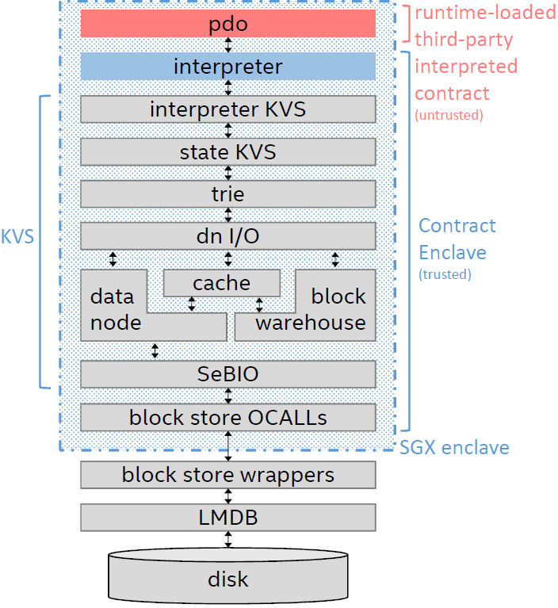
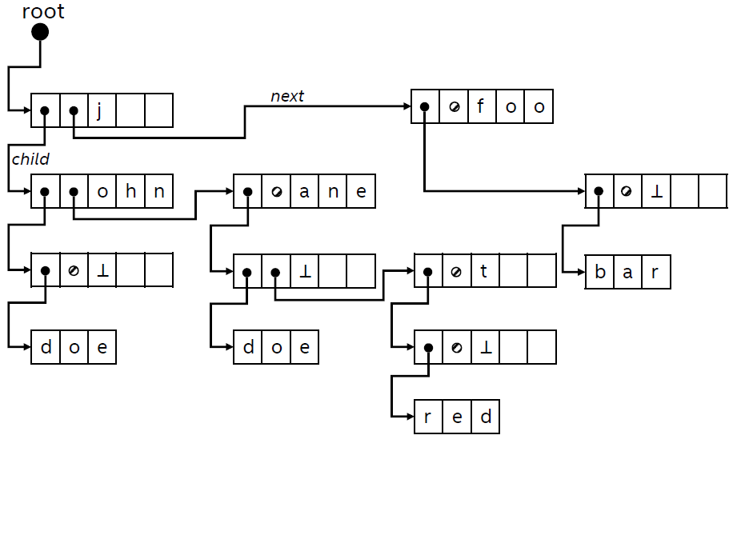

# Key-Value Store for PDO

## Goal and Objectives
The goal of the Key-Value Store (KVS) is to expand the domain of applications for Private Data Objects (PDO) by enabling
contracts to access and process large-scale, encrypted state. The KVS focuses on five main objectives to accomplish this
goal. First, it aims at providing few APIs to support data storage for private data objects, as a set of key-value
pairs. PDO can therefore take advantage of a simple abstraction, which does not expose the complexity of the underlying
secure storage mechanism. The second objective is to enhance the confidentiality of both the keys and the values. Third,
to mitigate inference attacks based on access patterns. In particular, to increase the difficulty for an adversary to
infer useful information based on how the KVS accesses encrypted keys and values. The fourth objective is to support
large-scale data storage, beyond the enclave limits. Fifth, to provide efficient, resilient operations, which can be
additionally tested outside of an SGX enclave.

## Overview

The code in `${PDO_SOURCE_ROOT}/common/state` implements a key-value store for PDO contracts. The KVS is meant to be
accessed by code inside the enclave, through the interface defined in `interpreter_kv.h` -- although a non-secure
version is also available outside of the enclave for testing purposes. In particular, there exists one KVS associated
with each contract. The Contract Enclave can use the KVS to store contract metadata, and a contract can use it
(indirectly, through the contract interpreter) to store arbitrary contract data as a set of key-value pairs.

The KVS interface exposes privileged and unprivileged APIs, which serve to securely partition any metadata from contract
data. Specifically, the former are meant to be used by the contract interpreter and/or any non-contract code, while the
latter are meant to be used by the contract code. Since the Contract Enclave loads an arbitrary contract code at
runtime, this mechanism prevents any malicious or bugged contract to tamper with any metadata stored by the rest of the
Contract Enclave.

Internally, the KVS essentially structures key-value pairs in a trie structure and it maintains such structure
serialized in a blocked array, i.e., a sequence of state blocks. The state blocks are authenticated and encrypted (resp.
validated and decrypted) when they are unloaded to (resp. loaded from) the untrusted environment. The default algorithm
for authenticated encryption is AES-GCM.

In the following, first we describe [how the KVS is used](#interface-kvs-is-the-callee) in PDO and what its
[dependencies](#requirements-kvs-is-the-caller) are. Then, we describe [how the KVS works internally](#internals).

## Usage and Dependencies

### Interface (KVS is the callee)
The KVS is designed to store and retrieve data for Smart Contracts and metadata for the Contract Enclave.
In particular, the Interpreter KVS (see figure) exposes an API, which a Contract Interpreter can use for data
storage.

The API contains privileged (meant for non-contract code) and unprivileged (meant for contract code) `put`, `get` and
`delete` operations -- see `interpreter_kv.h`. The separation is necessary because the Contract Enclave and the
contracts follow different security models. The Contract Enclave (including the contract interpreter) loads contracts at
runtime and stores contract-related metadata in the KVS. Instead, a contract is an arbitrary piece of code that can be
loaded and executed by the interpreter, and which stores contract data in the KVS. Hence, in a naive implementation, a
purposefully built contract code could intentionally modify the metadata stored by the Contract Enclave. The KVS
addresses this issue by using two sets of operations to separate the archival of the key-value pairs for metadata and
for contract data. As a result, this allows the Contract Enclave and the contract to securely share the storage space.
More precisely, the Contract Enclave uses the privileged operations for its own key-value pairs. However, when the
storage operations originate from untrusted contracts, the interpreter handles them using the unprivileged KVS
operations. Therefore, arbitrary contracts cannot access or tamper with the key-value pairs originated from the Contract
Enclave.

Keys and values are arbitrary binary data. In particular, they are of `ByteArray` type, which is defined as
`std::vector<uint8_t>` type.

#### Constructors
The contract enclave creates, or opens, the KVS for a specific contract. The KVS has two constructors: one useful for
creating a new KVS (i.e., the initial contract state) and another for opening an existing one (i.e., the input state of
a contract). These allow the contract enclave and the contract to begin operate on a shared storage, though in separate
domains through the privileged and unprivileged operations.

Both constructors expect as input the secret key (i.e., a byte array) for the cryptographic operations, since the stored
data and metadata is both authenticated and encrypted with the state encryption key. Additionally, the constructor for
opening a KVS requires the [state root](#root-block) of the existing KVS. Currently, this is a SHA-256 hash value (256
bits). The value is returned by the `Finalize()` operation -- in a previous call to close the KVS and get the state
root.

#### Finalize
This is the operation that *closes* the KVS and returns the state root, which is a SHA-256 hash value representing the
identifier of the whole contract state. In particular, in PDO, such state root (returned by `Finalize`) identifies the
output state, which is then attested by the Contract Enclave. Similarly, the value also identifies the input state in a
future contract method invocation.

#### Privileged Get/Put/Delete
The privileged operations allow the interpreter to retrieve, store or delete key-value pairs. Combined with the
unprivileged operations, this enables a secure partitioning of trusted interpreter-originated and untrusted
contract-originated key-value pairs in the same storage.
The *Interpreter KVS* implements these operations by prepending the `'P'` character to the original keys. Then, it calls
the `Get`, `Put` and `Delete` operations of the underlying *State KVS*.

#### Unprivileged Get/Put/Delete
The unprivileged operations allow the interpreter to retrieve, store or delete key-value pair that originated from the
contract code. Briefly, the interpreter exposes KVS operations to the contract code; this API wraps calls to the
unprivileged KVS operations. This allows to separate interpreter-originated and contract-originated key-value pairs in
the same storage.

The Interpreter KVS implements these operations by prepending the `'p'` character to the original keys. Then, it calls 
the `Get`, `Put` and `Delete` operations of the underlying *State KVS*.

### Last-Level Component: Secure BlockI/O
The lowest-level component of the KVS is a block I/O interface implemented in `sebio.h` (SEcure Block I/O). The
interface implements two main functions, `fetch` and `evict`, to respectively load and unload data blocks from/to the
untrusted environment. These data blocks are treated as arbitrary binary data, i.e,. byte arrays. They mostly have
fixed-size (see [block list](#block-list)) with some exceptions (see [root block](#root-block)).  There exists a third
function, `set`, which is useful to intercept these calls and implement a custom interface. Technically, the function
simply changes the default pointers to the functions for fetching and evicting blocks.

*Any* data block which is used by the KVS passes through the SeBIO interface.

### Dependencies of the KVS
Inside the enclave, the SeBIO interface is not at the edge between trusted and untrusted code. SeBIO uses the block
store interface implemented inside the enclave, which in turn wraps a set of `OCALLs` (defined in
`${PDO_SOURCE_ROOT}/eservice/lib/libpdo_enclave/block_store.h`) to retrieve or output data blocks.

This design mainly aims at improving the reusability and simplify testing of the KVS code. In fact, although the code is
intended for the enclave, it contains no SGX or enclave dependencies, and can be easily compiled and used outside of the
enclave.

## Internals
The overall KVS is a set of data blocks, namely: a root block and a set of fixed-size data blocks. The (fixed) size is a
compile-time parameter. All these blocks are stored as key-value pairs in the untrusted environment using
[LMDB](http://www.lmdb.tech/doc/), where the key is the SHA-256 hash of the block, and the value is the block itself.
These blocks represent the data units requested and output by the contract enclave. Also, they are replicated to the
storage services.

Roughly speaking, from a functional perspective, the concatenation of the fixed-sized blocks is the flat storage space
where the KVS serializes key-value pairs. From a security perspective, the root block implements a hash tree over the
set of fixed-size blocks.

Such structure is not exposed to the interpreter and the contracts. These components only read and write key-value
pairs through KVS operations.

### Data Blocks
A data block is a byte array, which contains arbitrary (i.e., encrypted or plaintext) data -- see `StateBlock.h`. The
hash of this block is its integrity measurement, and we also refer to it as block *identifier* (or *block ID*). When
performing I/O, storage and replication of such data blocks, we typically treat them as key-value (or name-content)
pairs, where the key is the SHA-256 hash of the block and the value is the block itself.

### Root Block
The root block is the root of a hash tree built over the contract state. This is a data block which contains the
(ordered) list of all data blocks that constitute the contract state. Therefore it has a dynamic size, since the size of
the contract data (and so the number of blocks) can change over time. The SHA-256 hash of the root block is the state
root.

The root block contains plaintext data organized as a JSON blob. The blob has two fields: `BlockIds` and `BlockIdsAuth`.
The former is an array of block IDs. This allows the untrusted environment and external parties (e.g., clients) to know
what blocks constitute the contract state, and to request their content if necessary. The latter is the HMAC computed
over all the block IDs keyed with the state encryption key (see `StateUtils.cpp` for details). This allows to protect
the integrity and the order of the IDs.

The root block is the first data block which is loaded and validated by a contract enclave. Therefore, the contract
enclave only accepts as input any state it previously authenticated and output.

### Block List
The list is an ordered sequence of block IDs. The (ordered) content of the blocks associated to the IDs represents the
flat structure -- essentially a big array -- of the KVS, and so of the contract state.

The block IDs in the list all refer to data blocks of fixed size. Almost all of these blocks contain key-value pairs
organized in a [trie structure](#trie-structure), while some others are used for storing internal metadata (separate
from key-value pairs metadata stored by the contract interpreter). For instance, the last data block belongs to the
[free space collector](#free-space-collector).

### Trie Structure
Key storage is implemented using a trie (or [prefix tree](https://en.wikipedia.org/wiki/Trie)) (`trie.h`, and see KVS
figure). Keys are stored in trie nodes which connect to leaf nodes where the values are stored. The trie root node is
stored in the first data block. From there, operations simply process the node structure and then iteratively walk the
trie through the stored pointers.

It is worth noticing that trie operations are non-recursive. This moves memory pressure from the enclave's stack to the
enclave's heap.

#### Trie Node Pointer
A node pointer is a pair of unsigned integers (block number and offset) which indicates where to find a trie node
structure. In the code, such pointer is named `block_offset` (see `block_offset.h`).

#### Trie Node Data Structure
A Trie Node is a 32 bytes data structure defined in `trie.h`.

| header | next node pointer | child node pointer | key chunk |
|--------|-------------------|--------------------|-----------|
| 1-byte | 8-bytes           | 8-bytes            | 15-bytes  |

The header is defined as follows:

| isDeleted | hasNext | hasChild | isValue | key chunk size |
|-----------|---------|----------|---------|----------------|
| 1 bit     | 1 bit   | 1 bit    | 1 bit   | 4-bits         |

Leaf nodes follow a different convention, being represented as:

| header (with isValue bit set)| value size | value |
|------------------------------|------------|-------|
| 1 byte                       | 4 bytes    | value |

#### Example of Trie Structure
The example below shows how the pairs `<john, doe>`, `<jane, doe>`, `<janet, red>` and `<foo, bar>` are placed on the
trie. Full circles and arrows represent pointers; slashed circles represent null pointers (end of list); the bottom
symbol represents an end of string (when two strings match, then the child pointer points to the stored value).

#### Trie Node Splitting
Node splitting is a procedure that is necessary to fork a trie node. This may occur during `put` operations, when the
stored key chunk and the incoming key chunk share a common prefix. For example, let `abcd` be the stored key chunk and
`abef` the key chunk we want to insert in the trie. The procedure removes `abcd` and creates `ab`, whose child pointer
points to `cd`. In the insert operation, the two original chunks will share the `ab` prefix, and the next pointer of
`cd` will point to the remaining `ef` chunk.

#### Trie Node Consolidation
The consolidation procedure is the inverse of the splitting procedure above. If a trie node has no next node and has
enough space to contain also the key chunk of its child node, then such trie node and its child can be merged. The
procedure is useful for efficiency: it saves space by deleting nodes, and it speeds up access time by reducing the path
length to a leaf node. Differently from the splitting procedure, node consolidation is not critical for the trie
operations; it is optional and delegated to the [compaction](#kvs-compaction) procedure.

### Data Node I/O Component
The Data Node I/O component (see `data_node_io.h`) acts as an orchestrator below the trie to coordinate operations on
data blocks, such as: block I/O, block caching, reads and write across multiple blocks, free space management. To
perform these tasks, the data node I/O component includes: a block warehouse to list the IDs that constitute the state;
two operations (`read_across_data_nodes` and `write_across_data_nodes`) to perform reads and writes for the trie
component; a free space collector to keep track and enable reuse of free space in blocks.

Given the available read and write operations, it should be clear that data deletion is performed by marking stored data
as deleted and informing the collector of the free space. The case where the free space makes the contract state
unreasonably large is handled by the KVS [compaction](#kvs-compaction) operation.  

#### Block Warehouse
The block warehouse (`block_warehouse.h`, and see KVS figure) maintains the list of block IDs at runtime, by adding,
removing and updating them. In particular, the such list is deserialized from the JSON blob in the root block, when the
KVS is opened, and serialized when the KVS is finalized.

#### Free Space Collector
The free space collector (see `free_space_collector.h`) provides with a mechanism for keeping track and reusing free
space in data blocks, for instance when trie nodes or values are deleted from the KVS. In particular, it exposes the
`collect` and `allocate` primitives, which internally maintain a table of position-length pairs.

The collector's table is persisted in the KVS when this is [finalized](#finalize), and reloaded when the KVS is opened.
Currently, such table is stored in a separate block and, precisely, in the last data block listed in the block list.

Most importantly, the table storage is designed to consume exactly one block. This has two consequences: (i) the KVS
incurs a one-block space overhead, (ii) the collector can persist a limited number of space items. The collector
mitigates this limitation by consolidating adjacent free spaces in order to reduce the table's memory footprint, namely:
if `(position-A,length-A)` and `(position-B,length-B)` are two items such that `position-A + length-A = position-B`,
then only `(position-A, length-A + length-B)` is stored. Also, the limitation is addressed by triggering the
[compaction](#kvs-compaction), which reduces the overall size of the KVS and the size of the collector's table.

#### Cache
The KVS implements a cache for fixed-size data blocks in order to reduce block I/O, and so increase performance -- see
`cache.h`. When the KVS repeatedly accesses a small subset of data blocks, this allows to save computation (data
encryption and decryption) and data transmission across enclave's boundaries, because the cache keeps these block
locally.

The cache is designed as a fixed-size memory region, which is allocated in the [data node I/O](#data-node-io-component)
object when the KVS is created/opened. In particular, it is constituted by a set of data blocks organized in a queue of
available (empty) blocks. When a new block is created, or an existing block is loaded, the cache dequeues a block (and
fills it if necessary). Similarly, when a block is released, the cache enqueues the block, thereby making it available.

The reference to (possibly cached) data blocks is performed through the block number -- not through the block
identifier, as this may change by modifying the content of the block, and the change may not be immediately reflected in
the list. A map structure is the link between a block number and a possibly modified cached data block. Specifically,
the structure maps a block number (if any such block number and block have been already cached) to a *block cache entry*
structure. Such an entry contains a reference to the data block itself, plus additional information like a modified bit
flag or a clock. The additional information helps in the data block replacement operations, for example: blocks that
have not been modified are simply discarded.

Finally, the cache has access to the [block list](#block-list). This allows the cache to map block numbers to block
identifiers. Hence, given a block number, the cache can load an existing block, or evict a modified block. The latter
operation involves: encrypting of the data block, hashing it to compute its ID, updating the ID in the block list, and
transmitting the (encrypted) block to the untrusted environment for storage.

### KVS Compaction
The objective of the KVS compaction is to reduce the overall free space by deleting empty blocks. Compaction is meant to
work in 3 steps and to be triggered when the [free space collector](#free-space-collector) fills up its table. In the
first one, trie nodes are consolidated, where possible. Hence, some trie nodes may be deleted. In the second one,
key-value pairs are moved towards lower block-number and offset positions, so to make the free space float towards the
blocks at the end of the block list. In the third step, empty blocks are removed from the list, thereby effectively
decreasing the overall size of the KVS.

*This is a TODO feature.*
